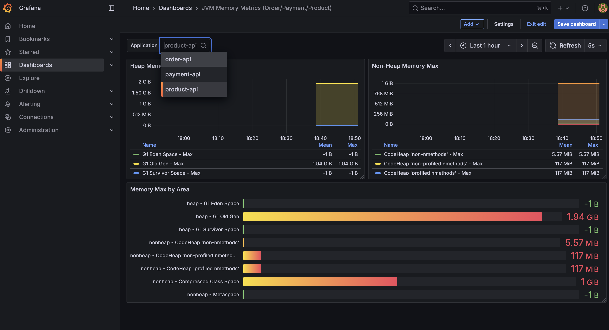

## my-msa

구현 요구 사항

1. **상품(Product) 서비스** - 상품 정보 조회 API 구현
2. **주문(Order) 서비스** - 주문 생성 및 Kafka 이벤트 발행
3. **결제(Payment) 서비스** - Kafka 이벤트 소비 및 결제 상태 관리
4. **모니터링 및 배포 자동화** - Prometheus/Grafana를 활용한 모니터링 및 GitHub Actions CI/CD 적용

프로젝트 구조

```html
my-msa/ msa-order/ # 주문 서비스 (Spring Boot, MySQL, Kafka) msa-product/ # 상품
서비스 (Spring Boot, MySQL) msa-payment/ # 결제 서비스 (Spring Boot, MySQL,
Kafka) kafka/ # Kafka/Zookeeper prometheus/ # Prometheus & Grafana 구성
```

세션 시간때 배운 프로젝트를 기반으로 kafka, prometheus, Grafana만 분리하고 msa-net 네트워크를 구성하여 주문, 상품, 결제 도메인에 공유하도록 구성하였습니다.


이 프로젝트는 상세한 업무 계획보다는 Kafka를 활용한 이벤트 기반 아키텍처의 흐름을 이해하는 데 중점을 두었습니다. 이벤트가 발생하면 Kafka 토픽을 통해 다른 서비스로 전달되고, 해당 서비스의 컨슈머가 이를 수신하여 후속 업무 로직을 처리하는 과정을 구현해보았습니다.

## Prometheus/Grafana를 활용한 모니터링



프로메테우스에 각 업무 API를 등록하여 **Grafana에서 모니터링할 수 있도록 구성하였습니다.**

## GitHub Actions CI/CD 적용


https://github.com/ChaHyunHo/my-msa/actions/runs/16860423944/job/47759806525

외부 서버를 직접 제어하여 배포하는 스크립트는 제외하고, 러너 내에서 각 컴포즈를 실행하여 컨테이너를 생성한 후 각 업무 API가 로컬에서 정상적으로 실행되는지 확인하는 과정으로 마무리했습니다.
